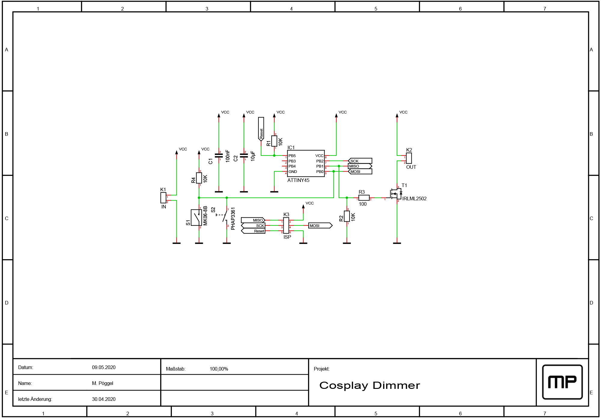

# Cosplay dimmer


## Project overview

Simple single channel PWM brightness control I made for a friend's cosplay. Uses a reed switch so it can be hidden behind foam parts, switching through different brightness levels is done with a magnet. Alternatively a regular tactile switch may be used. When the LED is completely switched off, a low power standby (~20µA) is implemented, making it ideal for battery powered applications. As power source either 2-3 1,5V batteries or a 5V power bank are possible.

## Schematic

[](documents/schematic.pdf)

There are just a few components around the ATTiny45 microcontroller. The capacitors C1 and C2 stabilize the power supply, R1 and R4 are the pull up resistors for the reset signal and switch input, and the MOSFET T1 is used for driving the LED output.

## Circuit board

The double sided circuit board is designed using Target 3001 software, you'll also find the Gerber fabrication files in this repository. Just upload them to a PCB manufacturer of your choice, e.g. [Aisler](https://aisler.net/p/JEISYEOM), [OSHPark](https://oshpark.com/shared_projects/XIAtSLBW) or [Elecrow](https://www.elecrow.com/pcb-manufacturing.html).

## Firmware

For simplicity this project uses the PlatformIO build system. After installing it, just run the commands described below.

You might need to change platformio.ini to your programmer used. The circuit board has a 6 pin AVR ISP connector on the back side. I'd recommend soldering wires to those pads during the programming progress.

Compile the code:
```
platformio run
```

Write fusebits of the AVR microcontroller (only needs to be done once):
```
platformio run -t fuses
```

Flash firmware:
```
platformio run -t upload
```

## Customizing

If you like to change or add brightness levels, just modify the pwm_values[] array in the code, then compile and flash it again.

## License

The whole project is released under the terms of [GNU GPL v3](http://www.gnu.org/licenses/gpl-3.0.en.html).
